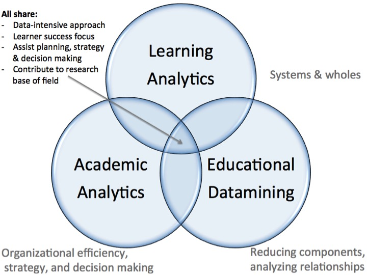
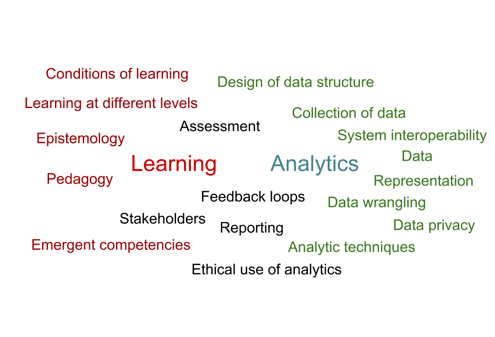

Learning Analytics in the Knowledge Age
========================================================

 
Bodong Chen, Assistant Professor 
University of Minnesota 
February 11, 2015

</img>

About Myself
========================================================

- Beijing Normal / Peking U / U of Toronto alumnus
- Joined LT in January 2015
- Research areas
  - knowledge building
  - learning analytics
  - online learning (MOOCs)
  - social media
- (An R hacker + a fan of reproducible research)

More on my personal website: <a href="http://meefen.github.io/">http://meefen.github.io/</a>

<!--
Learning Analytics in the Knowledge Age

- What is (are) Learning Analytics?
- Historical Roots
- State of the Field
- Examples
- Future Directions

-->

Learning Analytics: The Promise
========================================================

(Pea, 2014)

Education Paradigms (Ken Robinson)
========================================================

Varied learning environments
========================================================

</img>

<a href="http://life-slc.org/about/citationdetails.html">(LIFE Center: Stevens, R. Bransford, J. & Stevens, A., 2005)</a>

Student diversity
========================================================
title: false

</img>

***

Student Diversity 
represented by work status

<small>([2011 American Community Survey](http://www.census.gov/prod/2013pubs/acsbr11-14.pdf))</small>

Multiple Intelligence & Cognitive Styles
========================================================
left: 70%

***

(Gardner, 1983)

MOOCs
========================================================
title: false

</img>

Participatory Culture (Jenkins, 2006)
========================================================

The Challenges to Support Learning in the Knowlege Age
========================================================

Since learning is __plural__ and __ubiquitous__, we need to:

- understand _learning needs_ -- societal, organizational, personal
- understand _learners_ -- background, beliefs, values, dispositions...
- understand _learning_ when it occurs -- what, when, how, who...
- _impact/empower_ learning -- "feedback loops", engage stakeholders
- ...

Definition
========================================================
title: false

</img>

 

## Learning analytics is the ~~measurement, collection, analysis and reporting of data~~ about learners and their contexts, for purposes of understanding and optimizing learning and the environments in which it occurs.

Long & Siemens, 2011

Definition
========================================================
title: false

</img>

 

## Learning analytics is the measurement, collection, analysis and reporting of data about learners and their contexts, for purposes of ~~understanding and optimizing~~ learning and the environments in which it occurs.

Long & Siemens, 2011

Not New
========================================
type: prompt
title: false

</img>

But, Big + Rich Data
========================================

 

</img>
***

 

</img>

## An Emergent Data-Driven Culture

The Deal!
========================================

> To bring technical, pedagogical, and social domains into dialogue with each other

- computer scientists, machine learning experts, statisticians, and mathematicians had the technical capacity to make sense of large data sets, but lacked grounding in education and learning theory and literature
- learning scientists, psychologists, and sociologists had the theoretical lens to evaluate the social power structures and “soft domains” of learning, but lacked grounding in emerging data and analytics methods

(Siemens, 2014)

The (Young) Field of Learning Analytics
========================================

 

- 2011 -- First academic conference, Banff, Canada
- 2011 -- Inception of [Society for Learning Analytics Research](http://solaresearch.org/)
- 2013 -- First summer institute, Stanford University
- 2014 -- First issue of _Journal of Learning Analytics_

 
</img>

The Field of Learning Analytics
========================================================

Analysis of the Community of Learning Analytics <small>([Nawaz et al., 2013](http://ceur-ws.org/Vol-974/lakdatachallenge2013_05.pdf))</small>

</img>

The Field of Learning Analytics
========================================================
title: false

</img>

The Field of Learning Analytics
========================================================

Twitter community flow <small>([Chen et al., 2015](http://meefen.github.io/blog/2014/10/14/twitter-archeology/))</small>

</img>

The Field of Learning Analytics
========================================================

Topic modeling of LAK/EDM publications <small>([Sharkey et al., 2014](http://ceur-ws.org/Vol-1137/lakdatachallenge2014_submission_1.pdf))</small>

</img>

The Field of Learning Analytics
========================================================

Twitter community topics <small>([Chen et al., 2015](http://meefen.github.io/blog/2014/10/14/twitter-archeology/))</small>

</img>

Important Distinctions
========================================

 

> Learning Analytics vs. analysis of learning data

 

> Learning Analytics vs. Educational Data Mining (EDM)

 

> Learning Analytics vs. Academic Analytics

Contrasts
========================================
title: false

</img>

(<a href="http://www.slideshare.net/gsiemens/columbia-tc">Siemens, 2013</a>)

Articulate Learning Analytics
========================================

- LA involves (not necessarily big) digital data
- LA involves (not always complex) automated analytical processes
- LA informs / empowers learning and teaching
- (good) LA has a clear sense of what 'learning' means
- (good) LA is aware of its pedagogical and epistemological assumptions

Some Example Areas
========================================

- Analytics around **social interactions**
- Analytics around **learning content**
- Analytics of **learning pathways**
- Analytics in **different spaces** (digital/F2F)
- Analytics on interaction with the **learning system** (university/K-12/corporate)
- Analytics on **intervention and adaptation**
- **Evaluation** of analytics

(Adapted from <a href="http://www.slideshare.net/gsiemens/columbia-tc">Siemens, 2013</a>)

Examples
========================================
title: false

</img>

(<a href="http://www.slideshare.net/gsiemens/columbia-tc">Siemens, 2013</a>)

Examples
========================================
title: false

</img>

(<a href="http://www.slideshare.net/gsiemens/columbia-tc">Siemens, 2013</a>)

Techniques
========================================

Five primary areas of analysis (Baker & Siemens, in press; Baker and Yacef, 2009): 

- Prediction
- Structure discovery
- Relationship mining
- Distillation of data for human judgment
- Discovery with models

Applications
========================================

Five areas of application (Bienkowski, Feng, and Means, 2012):

- Modeling user knowledge, behavior, and experience
- Creating profiles of users
- Modeling knowledge domains
- Trend analysis
- Personalization and adaptation

A map
========================================
title: false

</img>

A messy view of LA, produced in Week 1 of my #LAUMN class

Important considerations
========================================

- Hidden assumptions (Knight, et al., 2013)
- Pedagogical interventions ([Wise, 2014](http://dl.acm.org/citation.cfm?id=2567588))
  1. Integration
  2. Agency
  3. Reference frame
  4. Dialogue
- Transparency in learning analytics practice
- Ethical practice

## Learning Analytics is For Learners & Learning!

<!--
New Competencies

- Learning dispositions
- Emotions
-->

Going Forward
========================================

To advance as a field, LA researchers and practitioners need to address the following: 

1. development of new tools, techniques, and people; 
2. data: openness, ethics, and scope; 
3. target of analytics activity; and 
4. connections to related fields and practitioners. 

(Siemens, 2014, at LASI 2014)

You should get involved!
========================================

- Attend LAK conferences (online sessions)
- Apply for LASI -- capacity building for the field
- Join online conversations (e.g., Twitter, [Google Group](https://groups.google.com/forum/#!forum/learninganalytics))
- More importantly, consider integrating LA in your work!

Guest speakers in my LA course:
- Simon Knight, Feb 12
- George Karypis & Jeff Gran, Feb 26
- Stian Haklev, Mar 5

Thanks!
========================================
title: false

  

# Q & A

 

- Email: chenbd@umn.edu
- Twitter: @bodong_c

