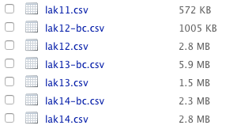

Week 2: A Brief Overview
========================================================
author: 
date: January 29, 2015

Updates & Questions
========================================================

Are you comfortable with:
- Knowledge Forum
- Social media
- ???

Any updates on interests in SIGs and WGs?

Readings
========================================================

- Siemens, G. (2013). [Learning Analytics: The Emergence of a Discipline](http://abs.sagepub.com/content/57/10/1380). American Behavioral Scientist, 0002764213498851. doi:10.1177/0002764213498851
- Bienkowski, M., Feng, M., & Means, B. (2012). [Enhancing teaching and learning through educational data mining and learning analytics](http://tech.ed.gov/wp-content/uploads/2014/03/edm-la-brief.pdf). Washington, DC: U.S. Department of Education. __(Only pp. 25-36)__
- (optional) Shum, S. B. (2012). [UNESCO Policy Brief: Learning Analytics](http://www.iite.unesco.org/publications/3214711/). Technical Report, UNESCO Institute for Information Technologies in Education.

A Recap of Discussed Issues
========================================================


- Techniques vs. Application
- Cross levels (micro, meso, macro)
- Implementing LA
  - [A report by Roy Pea](https://ed.stanford.edu/news/stanford-professor-spurs-movement-build-new-field-learning-analytics)
- Empowering learning
  - *of* vs. *for*
  - "leading to reflection, collaboration, linking ideas..."
  - learner control

- Discourse analytics
  - vs. content analysis
  - concrete examples
- LA and pedagogy!

Twitter Analytics: A Demo
========================================================
type: section

Chen, B., Chen, X, & Xing, W. (in press). ["Twitter Archeology" of Learning Analytics and Knowledge Conferences](http://meefen.github.io/public/files/Chen_LAK15_Twitter_Archeology.pdf). In Proceedings of the 5th Learning Analytics and Knowledge Conference (LAK15).

Basic Logic of Data Analytics
========================================================

Data Analytics Life Cycle


<small>[Source](http://www.ramganalytics.com/data-analysis-life-cycle/)</small>

Data Analytics Life Cycle (cont'd)
========================================================


<small>[Source](https://sites.google.com/site/mitraibanksolutions/)</small>

Data Analytics Lifecycle
========================================================


<small>[Source](https://infocus.emc.com/william_schmarzo/bills-most-excellent-data-scientist-adventure/)</small>

Methodological Dimensions
========================================================

1. Theoretical assumptions
2. Purpose of analysis
3. Units of action, interaction, and analysis
4. Representations
  - What representations of data and representations of analytic constructs and interpretati ons capture these units in a manner consistent with the purposes and theoretical assumptions? 
5. Analytic manipulations

(From [Productive Multivocality in the Analysis of Group Interactions](http://www.springer.com/education+%26+language/learning+%26+instruction/book/978-1-4614-8959-7), ch. 2)

In This Demo...
========================================================

Before the actual analysis

- Theoretical assumptions
- Purposes of analysis

Analysis of Twitter data

- Capture the data
- Data prep / cleaning
- Data exploration
- Data manipulation and analysis
- Communicate results

1. Theoretical assumptions
========================================================
incremental: true

- Interactions on Twitter are "real" and meaningful
- People tweeting about a conference reflect the make-up of the community
- 

2. Purposes of analysis
========================================================

- Understand characteristics of Twitter participation at 4 years of LAK conferences
- Track evolution of the LAK Twitter community, in terms of
  - # of participants
  - social interactions
  - influential figures
  - discussed topics


3. Capture the data
========================================================

The "magical" [Twitter Archiving Google Spreadsheet, TAGS](https://tags.hawksey.info/) by [Martin Hawskey](https://twitter.com/mhawksey)


A walkthrough of TAGS...

4. Data prep / cleaning (fun + not fun)
========================================================


4. Data prep / cleaning
========================================================



- Merge multi-year data
  - Match variable (column) names
  - Unify timestamp format
  - Extract URLs
  - Parse retweet and reply interactions
  - Clean up user id/name inconsistency
- Data sanity check

5. Data exploration
========================================================


- Load cleaned data


```r
setwd("~/src/r/shinyapp/twitterytics-shiny/lak")
suppressMessages(library(dplyr))
df = tbl_df(read.csv("new_lak.csv"))
glimpse(df)
```

- Exploration
  - Descriptive stats
  - Data visualization ([bonus slides](http://rpubs.com/bodong/data-vis-with-r))
- (_Reproducible Research_!)

6. Data manipulation and analysis
========================================================

R code walkthrough...

- `lak.Rmd`
  - descriptive
  - "community flow"
- `sna.R`
  - social network analysis
- `lda.R`
  - topic modeling


7. Communicate results
========================================================

Another hard part...

- Choices: text, a table, a figure...
- What was the question?
- Is the presentation biased/distorted? ([bonus](https://hbr.org/2013/04/how-to-tell-a-story-with-data?utm_source=Socialflow&utm_medium=Tweet&utm_campaign=Socialflow))
- *(By the way, try to avoid Pie Charts, and 3D Pie Charts especially...)*
- Look for inspirations!
  - [D3 examples](https://github.com/mbostock/d3/wiki/Gallery)
  - [visualizing.org](http://visualizing.org/)


House Keeping
========================================================

- Week 3
  - A bit more reading
  - Competencies you wish to assess? How? Gaps?
  - A chance to present your case! (5 - 10 min)
- __SIG and WG signup__ by Week 5
- KF clinic
  - *Promising Ideas; Remarks*
  - KF likes Chrome! (> Firefox > Internet Explorer)
  - Report issues in "Sandbox + KF Issues"
- Course materials hosted on [github.com/meefen/LA-UMN](https://github.com/meefen/LA-UMN)
  - Updated timeline, slides, etc.

Make announcements: ci5330_002s15@umn.edu
