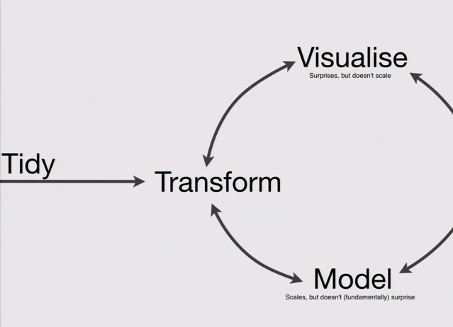
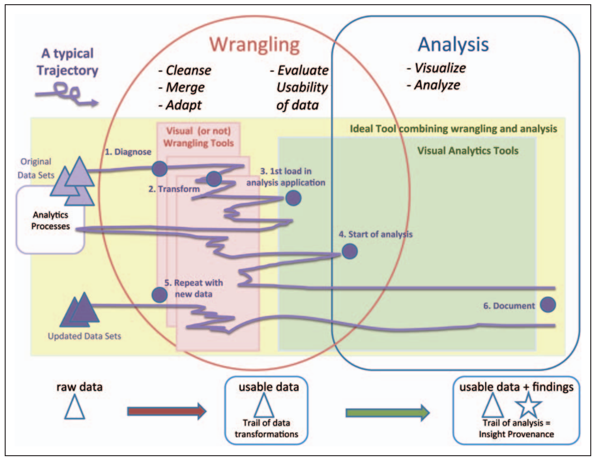

Week 7: Data Wrangling
========================================================
author: Bodong Chen
date: March 5, 2015

Agenda
========================================================

- Guest speaker: Stian Haklev
- Data wrangling: An introduction (Bodong)
- Demo: Data Wrangling in R (Ethan)
- Hands-on: Data Science Studio (Bodong)

Stian Haklev
========================================================

- [Video](https://www.youtube.com/watch?v=4_BR17BJTlA&feature=youtu.be)
- Connect (if baby says yes...)

Data!
========================================================

- Data is everywhere!
- Qualitative vs. Quantitative
- Levels of measure (e.g., nominal, ordinal, interval, and ratio)
- Unstructured vs. Structured
- Human-readable vs. Machine-readable
- Scattered vs. Linked
- ...

Data Wrangling/Munging
========================================================

Gathering, scraping, organizing, and mapping disparate datasets; converting, transforming, formatting, and visualizing data; managing and storing data; and more...

- A significant chunck of data scientists' job
- Data _accessiblity_ and data _sensemaking_ (Hirst)
- Exploratory
- Chit-chat with data
- ...

(Data Wrangler -- a sexy job :))

Tony Hirst's Framework
========================================================

Data accessiblity and data sensemaking

- Clean
- Shape
- Augment
- Look

([Slides](http://www.slideshare.net/psychemedia/conversations-with-data))

Hadley Wickham
========================================================

Pipelines of Data Analysis

Kandel et al.
========================================================

The iterative process of wrangling and analysis ([paper](http://vis.stanford.edu/files/2011-DataWrangling-IVJ.pdf))

Tidy data
========================================================

(Jeff Leek, _The Elements of Data Analytic Style_)

- Each variable you measure should be in one column
- Eachdifferentobservationofthatvariableshouldbein
a different row
- There should be one table for each “kind” of variable
- If you have multiple tables, they should include a
column in the table that allows them to be linked

Components of A Processed Dataset
========================================================

(Jeff Leek, _The Elements of Data Analytic Style_)

1. The raw data.
2. A tidy data set.
3. A code book describing each variable and its values in
the tidy data set.
4. An explicit and exact recipe you used to go from 1 to 2
and 3.

Demo: Data Wrangling in R
========================================================
type: section

by Ethan Brown

Hands-on: Data Science Studio
========================================================
type: section

by Bodong Chen

Data Science Studio (DSS)
========================================================

"[Data Science Studio](http://www.dataiku.com/dss/) (DSS) is a software platform that aggregates all the steps and big data tools necessary to get from raw data to production ready applications."

Key concepts in DSS

- Datasets
- Scripts
- Recipe
- Flow

Hands-on: Context & Questions
========================================================

The Toronto District School Board (TDSB) uses a __Learning Opportunity Index (LOI)__ to "rank each school based on measures of external challenges affecting student success; the school with the greatest level of external challenges is ranked number one and is described as highest on the index." TDSB recalculates LOI every two years.

Some questions to start with...
- Are schools progressing over the years?
- Do schools of different types--e.g., English vs. French, elementary vs. secondary, bigger vs. smaller, from different areas--progress differently?

Accessible Data
========================================================

- [TDSB Learning Opportunity Index](http://www.tdsb.on.ca/AboutUs/Research/LearningOpportunitiesIndex.aspx) (in PDF)
- [Ontario public school contact information](https://www.ontario.ca/data/ontario-public-school-contact-information) (in Excel)
- [Canadian Postal Codes](http://geocoder.ca/?freedata=1) (in CSV)
- [Ontario public schools enrolment](https://www.ontario.ca/education-and-training/ontario-public-schools-enrolment) (in Excel)

Expected Challenges
========================================================

- cleaning/cleansing (to an analyzable form)
- joining (linking and merging data together)
- augmenting (geopoints)

Start 'Dating' with DSS
========================================================

- New project: LOI
- Import your first dataset: LOI

Wait...
========================================================
type: alert

The data is in PDF!

Extracting table from PDF
========================================================

- Tabular: http://tabula.technology/
- PDF tables: https://pdftables.com/
- Adobe Acrobat

Using Adobe Acrobat!

Data Prepation Script
========================================================

- New project: LOI
- Import your first dataset: LOI (finally)
- Overview of the "Explore" interface
  - column indicator
  - filter
- Create preparation script
  - remove rows
  - rename cols (do not use white spaces!)
  - copy across cols
  - change data type

Recipe & Flow
========================================================

- Save as a Recipe
- View Flow

Visualize
========================================================

- Analyze a col
- Bar graph
  - Ward and Score
  - Add Rank
- Scatterplot
  - 2014 and 2009, circles by School_Name
  - Add filter

Edit Script
========================================================

- Generate new variables: ScoreChange, RankChange
- Change type: Ward, School_ID
- Update data

Revisualize
========================================================

- Bar graph: Ward and Scorechange, add RankChange
- Sort

More datasets
========================================================

- Contact Info
- Enrollment
- Postal

Cleansing
- Fix Enrollment col: <10
- Change col names in Postal

Join
========================================================

- Fuzzy join: LOI & Contact
- Join: Enrollment & Contact
- Join: Enrollment & Postal (failed)
- Join: LOI & Enrollment

Visualize
========================================================

- Bar graph
  - x: Ward
  - y: ScoreChange
  - Color: Level
- Scatterplot
  - SchoolSize
  - ScoreChange

Summary
========================================================

- Clean
- ~~Shape~~
- ~~Augment~~
- Look

Appx: Open Data
========================================================

- http://www.state.mn.us/opendata/data.html
- http://cascw.umn.edu/community-engagement-2/minn-link/minn-link-datasets/
- http://catalog.opendata.city/dataset/minnesota-education-indicators
- http://www.ciser.cornell.edu/ASPs/datasource.asp

